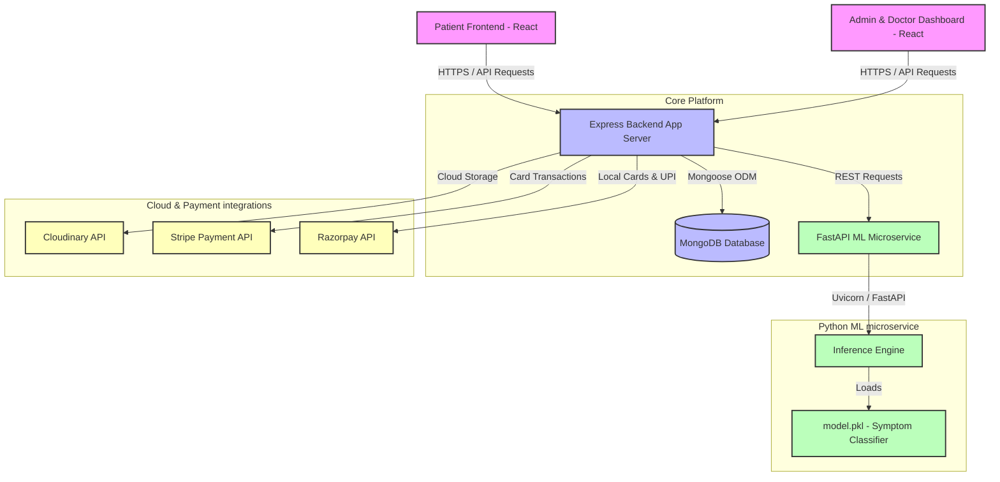

# 🩺 DocprescOps — Complete AI-Powered Healthcare & Consultation Platform

[](https://nodejs.org/)
[](https://react.dev/)
[](https://fastapi.tiangolo.com/)
[](https://www.mongodb.com/)
[](https://tailwindcss.com/)
[](https://www.docker.com/)

**DocprescOps** is a modern, full-stack healthcare ecosystem that seamlessly bridges patients, doctors, and administrators. It integrates an intelligent symptom-based over-the-counter (OTC) medicine recommendation engine powered by a dedicated Python Machine Learning microservice. The platform includes secure payment gateways (Stripe, Razorpay, Net Banking, and UPI), real-time appointment booking, admin dashboards, and comprehensive doctor schedules.

---

## 🏗️ System Architecture

The following diagram illustrates the relationship between the client portals, the central API server, third-party services, and the ML microservice:



---

## 🌟 Key Features

### 1. 👤 Patient Portal (`/frontend`)
*   **AI Symptom Analyzer & OTC Search**: Submit symptom text, age, gender, and medical history to retrieve matching OTC medicine recommendations with calculated confidence scores.
*   **Search History**: Access previous symptom-analysis records from your dashboard.
*   **Doctor Directory**: Filter and search through certified doctors by specialty, availability, and location.
*   **Dynamic Booking System**: Schedule, reschedule, or cancel virtual/in-person doctor appointments.
*   **Flexible Payment Hub**: Pay consulting fees securely via Stripe, Razorpay, instant Net Banking, or UPI.

### 2. 🎛️ Admin & Doctor Dashboards (`/admin`)
*   **Doctor Panel**:
    *   Set/update profile picture, experience metrics, consulting fees, and addressing hours.
    *   Toggle personal booking availability instantly.
    *   Track pending schedules, mark appointments as completed, or trigger cancellations.
    *   View real-time earnings stats and appointment counters.
*   **Admin Panel**:
    *   Create and onboarding new doctor accounts.
    *   Monitor system-wide metrics (total doctors, bookings, patient registrations).
    *   Oversee and cancel system appointments.
    *   Manage comprehensive doctor lists.

### 3. 🧠 Machine Learning OTC Engine (`/ml`)
*   **TF-IDF Symptom Vectorizer**: Processes raw user symptom queries into high-dimensional vectors.
*   **FastAPI Inference Server**: Serve high-performance, asynchronous endpoints running model evaluations.
*   **Custom Classifiers**: Recommends top matching drugs, standard dosages, potential side-effects, and critical healthcare precautions.

---

## 📂 Project Repository Layout

```
DocprescOps/
├── backend/                  # Node.js + Express API server
│   ├── config/               # MongoDB and Cloudinary connection configurations
│   ├── controllers/          # Business logic handlers (User, Doctor, Admin)
│   ├── middleware/           # JWT authenticators and file upload configurations
│   ├── models/               # MongoDB schemas (User, Doctor, Appointment, SearchHistory)
│   ├── routes/               # Express routing tables
│   ├── services/             # Core service integrations
│   ├── server.js             # API entrypoint
│   └── Dockerfile            # Container definition for backend
├── frontend/                 # Vite + React Patient client application
│   ├── src/
│   │   ├── assets/           # UI static icons, images, and brand design assets
│   │   ├── components/       # Global reusable UI blocks
│   │   ├── context/          # React AppContext (state management and global actions)
│   │   └── pages/            # View pages (MedicineSearch, Appointments, Doctor profile...)
│   └── Dockerfile            # Container definition for frontend
├── admin/                    # Vite + React Admin & Doctor client application
│   ├── src/
│   │   ├── components/       # Shared dashboard blocks
│   │   ├── context/          # Context states (AdminContext, DoctorContext, AppContext)
│   │   └── pages/            # Views (Dashboard, Doctor appointments, Doctor profiles...)
│   └── Dockerfile            # Container definition for admin portal
├── ml/                       # Python FastAPI Machine Learning microservice
│   ├── data/                 # Training raw datasets and configurations
│   ├── train.py              # Script to vectorize symptoms and train models
│   ├── serve.py              # FastAPI Web API application
│   ├── main.py               # Local testing scripts
│   ├── requirements.txt      # Python dependencies
│   └── Dockerfile            # Container definition for ML service
└── How_To_Run_Project.pdf    # Detailed operations guide PDF
```

---

## 🛠️ Step-by-Step Installation & Setup

### Prerequisites
Make sure the following engines are installed on your machine:
*   [Node.js](https://nodejs.org/) (v18.0.0 or higher)
*   [Python](https://www.python.org/) (v3.10.x or higher)
*   [MongoDB](https://www.mongodb.com/) (Local Community edition or Mongo Atlas Cloud cluster)

---

### Step 1: Configure & Launch Backend App Server
1.  Navigate into the `backend` directory:
    ```bash
    cd backend
    ```
2.  Install package dependencies:
    ```bash
    npm install
    ```
3.  Create a `.env` file in the `backend/` root directory and set the variables below:
    ```env
    PORT=4000
    MONGODB_URI="your_mongodb_connection_uri"
    JWT_SECRET="your_jwt_secret_key"
    
    # Third-Party Integrations
    CLOUDINARY_NAME="your_cloudinary_cloud_name"
    CLOUDINARY_API_KEY="your_cloudinary_api_key"
    CLOUDINARY_SECRET_KEY="your_cloudinary_api_secret"

    # Gateway Secrets
    CURRENCY="INR"
    STRIPE_SECRET_KEY="your_stripe_secret_key"
    RAZORPAY_KEY_ID="your_razorpay_key_id"
    RAZORPAY_KEY_SECRET="your_razorpay_key_secret"

    # ML Endpoint
    ML_SERVICE_URL="http://localhost:8000/predict"

    # Admin Account
    ADMIN_EMAIL="admin@docpresc.com"
    ADMIN_PASSWORD="your_secure_admin_password"
    ```
4.  Start the Express server:
    *   **Development mode (Hot reloading):**
        ```bash
        npm run server
        ```
    *   **Production mode:**
        ```bash
        npm start
        ```
    The server will startup on port `4000`.

---

### Step 2: Configure & Launch the ML Microservice
1.  Navigate into the `ml` directory:
    ```bash
    cd ml
    ```
2.  Set up a Python virtual environment and activate it:
    *   **On Windows (PowerShell):**
        ```powershell
        python -m venv .venv
        # Run the line below if script execution is blocked on your system
        Set-ExecutionPolicy -Scope Process -ExecutionPolicy Bypass
        .venv\Scripts\Activate.ps1
        ```
    *   **On macOS/Linux:**
        ```bash
        python3 -m venv .venv
        source .venv/bin/activate
        ```
3.  Install Python dependencies:
    ```bash
    pip install -r requirements.txt
    ```
4.  Train the medicine recommendation classification model:
    ```bash
    python train.py
    ```
    *This creates a serialized classifier model file `model.pkl` in the `ml/` directory.*
5.  Launch the FastAPI server:
    ```bash
    python -m uvicorn serve:app --host 0.0.0.0 --port 8000 --reload
    ```
    The ML microservice will now be listening at `http://localhost:8000`.

---

### Step 3: Configure & Launch the Patient Frontend
1.  Navigate into the `frontend` directory:
    ```bash
    cd frontend
    ```
2.  Install dependencies:
    ```bash
    npm install
    ```
3.  Create a `.env` file in the `frontend/` root directory and set the values:
    ```env
    VITE_BACKEND_URL="http://localhost:4000"
    VITE_RAZORPAY_KEY_ID="your_razorpay_key_id"
    ```
4.  Start the development server:
    ```bash
    npm run dev
    ```
    Open `http://localhost:5173` in your browser.

---

### Step 4: Configure & Launch the Admin Dashboard
1.  Navigate into the `admin` directory:
    ```bash
    cd admin
    ```
2.  Install dependencies:
    ```bash
    npm install
    ```
3.  Create a `.env` file in the `admin/` root directory:
    ```env
    VITE_BACKEND_URL="http://localhost:4000"
    ```
4.  Start the dashboard development server:
    ```bash
    npm run dev
    ```
    The dashboard will run on the port specified in terminal (typically `http://localhost:5174`).

---

## 🐳 Docker Deployment (Optional)

Every component is ready-containerized with custom `Dockerfile` templates. To launch the entire service cluster in container networks:

1.  Build and containerize the Python ML Service:
    ```bash
    docker build -t docprescops-ml ./ml
    docker run -d -p 8000:8000 --name docprescops-ml-container docprescops-ml
    ```
2.  Build and containerize the Backend:
    ```bash
    docker build -t docprescops-backend ./backend
    docker run -d -p 4000:4000 --name docprescops-backend-container --env-file ./backend/.env docprescops-backend
    ```
3.  Build and containerize the Frontends:
    ```bash
    # Frontend
    docker build -t docprescops-frontend ./frontend
    docker run -d -p 5173:5173 docprescops-frontend
    
    # Admin Panel
    docker build -t docprescops-admin ./admin
    docker run -d -p 5174:5174 docprescops-admin
    ```

---

## 🌐 Main REST API Reference

### 🧠 Machine Learning Engine
*   `GET /health` - Service health monitor check.
*   `POST /predict` - Symptoms classifier endpoint. Takes user input arguments and returns matching medicines.
    *   **Body Schema:**
        ```json
        {
          "symptoms": "severe headache and nasal congestion",
          "age": 32,
          "gender": "Female",
          "medicalHistory": "None"
        }
        ```

### 👤 Patient endpoints (`/api/user`)
*   `POST /register` & `POST /login` - Auth endpoints.
*   `GET /get-profile` & `POST /update-profile` - Profile management.
*   `POST /book-appointment` - Book doctor consultations.
*   `GET /appointments` - List patient's bookings.
*   `POST /cancel-appointment` - Cancel an active booking.
*   `POST /payment-stripe` / `/payment-razorpay` - Trigger payments.
*   `POST /medicine-search` - Symptom matching portal that forwards requests to ML microservice.
*   `GET /search-history` - Fetch previous symptom entries.

### 🎛️ Admin endpoints (`/api/admin`)
*   `POST /login` - Authentication.
*   `POST /add-doctor` - Add new doctor account to system.
*   `GET /appointments` - Fetch global bookings.
*   `POST /cancel-appointment` - Cancel an appointment.
*   `GET /dashboard` - System status and analytic numbers.

---

## ⚠️ Important Disclaimer

> [!WARNING]
> **This system is a proof-of-concept AI-powered OTC medicine suggestion tool.**
> The machine learning recommendations are based on standard training datasets and symptom classifiers.
> They are strictly intended for educational and testing purposes and must **NOT** be treated as a substitute for professional clinical advice, diagnoses, or prescriptions from a qualified healthcare practitioner. Always consult a physician before using any pharmaceutical products.
